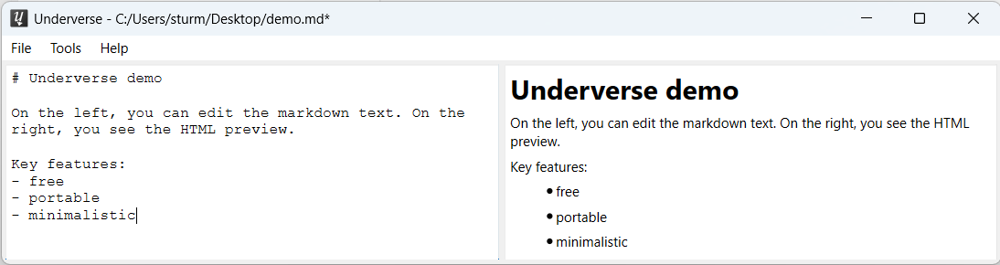

# *Underverse* - A free markdown editor

## Key features

* Free (MIT license)
* Portable
* Markdown editor with HTML preview and search

## Obtaining Underverse

Please use the ZIP file of the latest releases for Windows.  
If you want to use it on MacOS or Linux, you have to clone the GIT repository and build it yourself using Qt6.

## Bugs and Feature requests

Please use the GIT issue tracker!
